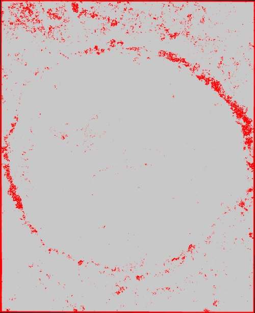
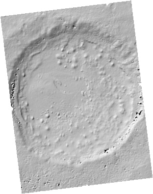

============
Tutorial
============

ASAP CTX Walkthrough
--------------------

Overview
^^^^^^^^

There are multiple ways to use ASAP to produce DEMs. We will start with making a CTX DEM.
The primary intended way to use asap is to use the two notebook-based workflow commands through the command-line interface. 
These two commands take a few parameters and will run a dozen or so individual steps serially. 
They are long-running commands for a single node, so using the nohup command is recommended to execute the program in the background.
As the notebook workflow runs, various log files will appear in the directory and an output Jupyter notebook file containing all the logs when the program finishes. 
If the user is curious, a full_log.log file can be "tailed" by the user.

Step 1: asap ctx notebook_pipeline_make_dem
^^^^^^^^^^^^^^^^^^^^^^^^^^^^^^^^^^^^^^^^^^^

We assume the user has already activated their conda environment and are in a new empty directory.
To start we need to select two CTX image IDs that we want to make a DEM of. All the steps to find
and select CTX image IDs are outside of the scope of this tutorial for now. But in any case we will
use a stereo pair of CTX data over Sera crater in Arabia Terra, Mars.

Our image Ids are B03_010644_1889_XN_08N001W and P02_001902_1889_XI_08N001W. 
Let's go ahead and take a look at them to see if there are any hazes or other issues.

.. figure:: https://image.mars.asu.edu/convert/B03_010644_1889_XN_08N001W.jpeg?image=http%3A//appserver.mars.asu.edu%3A8080/StampServer-1.2/ImageServer%3Fversion%3Dviewer-dev%26instrument%3Dprojected_ctx%26id%3DB03_010644_1889_XN_08N001W%26height%3D500%26imageType%3DPROJECTED_CTX&rotate=0&format=jpeg
    :width: 300
    :alt: B03_010644_1889_XN_08N001W 
    :figclass: align-left

    B03_010644_1889_XN_08N001W

.. figure:: https://image.mars.asu.edu/convert/P02_001902_1889_XI_08N001W.jpeg?image=http%3A//appserver.mars.asu.edu%3A8080/StampServer-1.2/ImageServer%3Fversion%3Dviewer-dev%26instrument%3Dprojected_ctx%26id%3DP02_001902_1889_XI_08N001W%26height%3D500%26imageType%3DPROJECTED_CTX&rotate=0&format=jpeg
    :width: 300
    :alt: P02_001902_1889_XI_08N001W 
    :figclass: align-right

    P02_001902_1889_XI_08N001W 

They look great!

We will also need a stereo.default file, I will use one provided with the Ames Stereo Pipeline for a CTX image pair in their documentation: stereo.nomap_.
Selecting the correct parameters for a given pair is outside of the scope for this tutorial, but the `Ames Stereo Docs`_ are a good place to start to learn more about the various parameters.

.. _stereo.nomap: https://raw.githubusercontent.com/NeoGeographyToolkit/StereoPipeline/master/examples/CTX/stereo.nonmap
.. _Ames Stereo Docs: https://stereopipeline.readthedocs.io/en/latest/stereodefault.html

Now that we have all of our components we are ready to run the first ASAP notebook workflow::
    
    nohup asap ctx notebook_pipeline_make_dem B03_010644_1889_XN_08N001W P02_001902_1889_XI_08N001W ./stereo.nonmap &

Again, we use the *"nohup ... &"* to run our command in the background, on a 8 core machine this step can take half an hour or so.
This one command will run several steps, replicating the workflow of the `asp_scripts`_ project steps of: ctxedr2lev1eo.sh, asp_ctx_lev1eo2dem.sh, asp_ctx_step2_map2dem.sh, and pedr_bin4_pc_align.sh.  
A notebook file, which default to be named "log_asap_notebook_pipeline_make_dem.ipynb" will also be created which we will explore later below.

.. _asp_scripts: https://github.com/USGS-Astrogeology/asp_scripts

Inspecting outputs from step 1
^^^^^^^^^^^^^^^^^^^^^^^^^^^^^^

Step 1 produces a number of visualization products, some can be viewed using various ASP tools, some are produced by ASAP for viewing in the output notebook logs.

The *Good Pixel Maps* help quickly visualize if ASP is able to make sense of the provided images. 

    
    Good Pixel Map from first pass DEM from step 1.

Hillshaded products quickly convey the textural quality of the DEMs.

    Hillshaded low-resolution DEM from step 1.

Step 2: asap ctx notebook_pipeline_align_dem
^^^^^^^^^^^^^^^^^^^^^^^^^^^^^^^^^^^^^^^^^^^^
Once the first step is over, we can move forward with aligning the CTX DEM to the MOLA topography and Datum. 
To do this, the maximum expected disparity between MOLA and CTX DEMs needes to be estimated,
that is the cartesian distance between a point on the reference (MOLA) and the corresponding point in the CTX DEM, which combines the vertical and horizontal displacement magnitudes. 
A way of visualizing this step is to imagine stacking two plates, the bottom plate (MOLA) is held fixed,
while the plate to stack (CTX) is somewhere in 3D space. The plate must be moved vertically, 
forward and back, and left to right to stack it on top of the MOLA plate. The magnitude of this translation is the maximum displacement, 
which will minimize the distance between them once applied to the point clouds.
Generally, the disparity between the CTX DEM in step one is only on the order of half a kilometer or so, but can increase to several kilometers when dealing with uncooperative image pairs. 
The disparity is generally estimated by loading the last DEM.tif file made by step 1 and the MOLA PEDR data produced by the last part of step 1 into a GIS environment and visually inspecting and differencing the data.

For now we will just assume the default half kilometer disparity for our CTX pair, future tutorials may discuss the topic further.
So for now we will run the second step with the default arguments.:: 

    nohup asap ctx notebook_pipeline_align_dem &

This command will create a notebook log file called "log_asap_notebook_pipeline_align_dem.ipynb". On the same machine used for step 1 this step took around 4 minutes.

The final data products for CTX are located in the diretory: *ID1_ID2/results_map_ba/dem_align/* where ID1 & ID2 are our CTX image ids. 
The final science-ready DEM file ends with the extension *_DEM-adj.tif*, the "adj" indicates the file is adjusted to the geoid.
The final orthorectified images end with *_DRG.tif*. By default, for CTX images, ASAP will produce 6-meter orthorectified images and 24 meter DEMs.
CTX data generally has better-than 6 meter GSD (~5.5 Meters per pixel), but the GSD is rounded up to produce conservative results for safety. 
This behavior can be overridden by the users at runtime using the various command-line arguments and kwargs. For more information regarding the various output files from Ames Stereo, please see `their docs. <https://stereopipeline.readthedocs.io/en/latest/outputfiles.html>`_

Congratulations, you have just made at DEM with ASAP!
